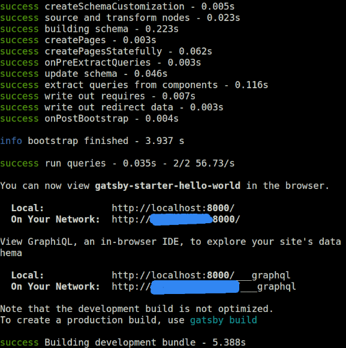
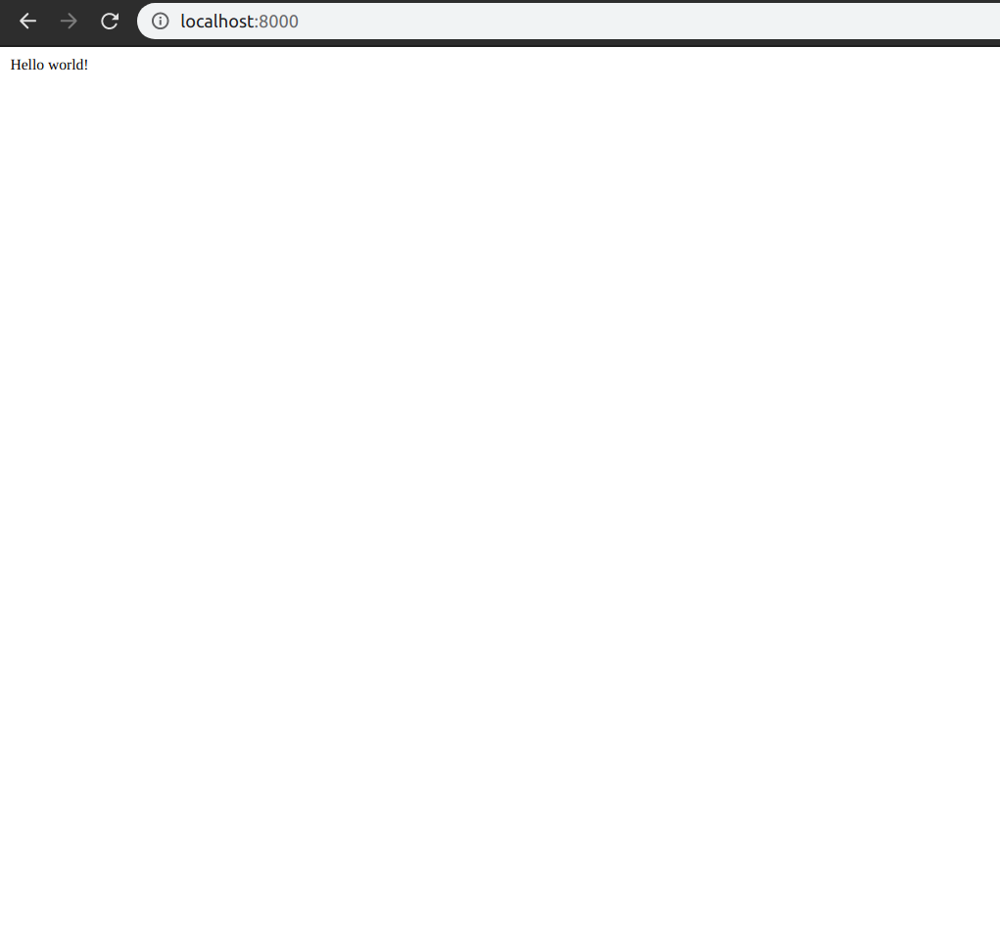

#なぜやるのか
自分の技術メモを残したいと思い,この度技術ノートを作成することにしました.
作成する上で,できる限り管理が楽なものをと思い,静的サイトジェネレータでGatsby.jsというものがあったので導入することにしました.

本記事はGatsby.jsをdocker上で構成しHello world!まで行った時の備忘録です.

完成後のディレクトリ構成は以下の通りになります.

```
.
├── docker-compose.yml
├── Dockerfiles/gatsby/Dockerfile
└── hello-world
```
#Dockerの前準備

まずはdocker-compose.ymlから.

Dockerfiles/gatsby/Dockerfiles を読み込みます.

portは8000番を使います

```yml:docker-compose.yml
version: '3'
services:
  webserver:
    build: ./Dockerfiles/gatsby/
    ports:
      - "8000:8000"
    volumes:
     - ./:/usr/src/app
    environment:
      - NODE_ENV=development
    tty: true
```

次にDockerfileです.

今回はimgesはubuntu 18.04を使いました.
gitやnode.js, Gatsby.jsをインストールします.

./Dockerfiles/gatsby/Dockerfile
```Dockerfile:Dockerfile
FROM ubuntu:18.04
EXPOSE 8000
RUN apt-get update && apt-get upgrade -y
RUN apt-get install -y git 
RUN apt-get install -y wget
RUN apt-get install -y curl 
RUN apt-get install sudo -y

RUN apt install -y nodejs npm
RUN npm install n -g
RUN n stable
RUN apt purge -y nodejs npm

RUN npm install -g gatsby-cli


ARG DOCKER_UID=1000
ARG DOCKER_USER=docker
ARG DOCKER_PASSWORD=docker
RUN useradd -m --uid ${DOCKER_UID} --groups sudo ${DOCKER_USER} \
  && echo ${DOCKER_USER}:${DOCKER_PASSWORD} | chpasswd
USER ${DOCKER_USER}

WORKDIR /usr/src/app
```

イメージのbuildとコンテナの立ち上げを行います.

```
$ docker-compose up --build
```

以下のコマンドで仮想環境に入ります.

gatsby-notes_webserver_1は各環境で添字等が変わるので適時読み替えてください.(大体はTabキーの補完でどうにかなるとは思いますが)

```
$ docker exec -it gatsby-notes_webserver_1 /bin/bash
```

#Gatsby.js
それではGatsby.jsでHello worldをしていきましょう.

ここからは公式ドキュメントどおりです.


公式が用意しているスターターキットを使います.
```
$ gatsby new hello-world https://github.com/gatsbyjs/gatsby-starter-hello-world
```
しばらく待ち,




このように表示されていれば成功のはずです.

hello-worldというディレクトリができたと思います

そこに移動して,gatsby develop を行い

```
$ cd hello-world
$ gatsby develop --host=0.0.0.0
```

[http://localhost:8000/](http://localhost:8000/)

をブラウザで開くとHello wolrd!と表示されているのが確認できるはずです.




#まとめ
これで一応Gatsby.jsの環境がdocker上でできあがっていることになると思います.

ちなみにこのサイトもGatsby.js製です.いつかサイト作成についても記事にしようと思います.


以上, docker上でGatsby.js環境を構築しHello World!するまででした.

