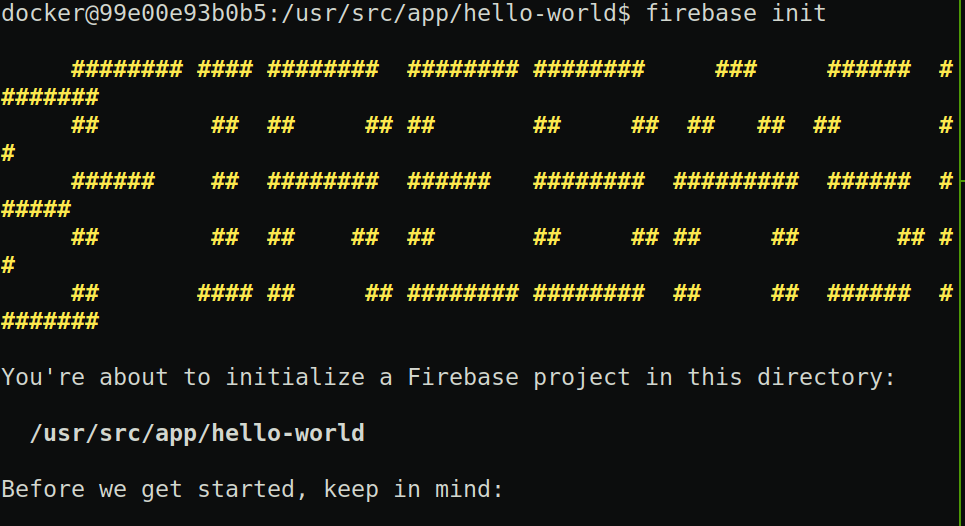
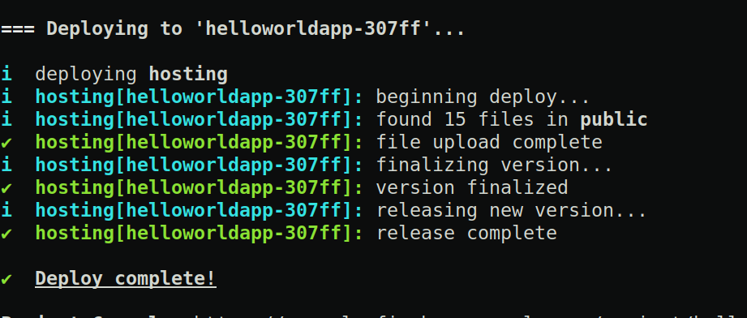

#なぜやるのか
前回Gatsby.jsを使ってサイトの構築のデモを行ったので,今回は公開できる様にdeployします.
本記事はdocker上で構成したGatsby.js製のサイトをfirebaseにdeployするまで行った時の備忘録です.

まず現時点でのディレクトリ構成は以下の通りになっていると思います.
```
.
├── docker-compose.yml
├── Dockerfiles/gatsby/Dockerfile
└── hello-world
```
#Dockerfileの編集


deploy先としてfirebaseを使うためDockerfiles/gatsby/Dockerfiles の編集を行います.

firebase-toolsをインストールします

./Dockerfiles/gatsby/Dockerfile

```Dockerfile:Dockerfile
FROM ubuntu:18.04
EXPOSE 8000
RUN apt-get update && apt-get upgrade -y
RUN apt-get install -y git 
RUN apt-get install -y wget
RUN apt-get install -y curl 
RUN apt-get install sudo -y

RUN apt install -y nodejs npm
RUN npm install n -g
RUN n stable
RUN apt purge -y nodejs npm

RUN npm install -g gatsby-cli

RUN npm install -g firebase-tools


ARG DOCKER_UID=1000
ARG DOCKER_USER=docker
ARG DOCKER_PASSWORD=docker
RUN useradd -m --uid ${DOCKER_UID} --groups sudo ${DOCKER_USER} \
  && echo ${DOCKER_USER}:${DOCKER_PASSWORD} | chpasswd
USER ${DOCKER_USER}

WORKDIR /usr/src/app
```

docker-compose.ymlは前回と同じです.

```yml:docker-compose.yml
version: '3'
services:
  webserver:
    build: ./Dockerfiles/gatsby/
    ports:
      - "8000:8000"
    volumes:
     - ./:/usr/src/app
    environment:
      - NODE_ENV=development
    tty: true
```

イメージのbuildとコンテナの立ち上げを行います.

```
$ docker-compose up --build
```

前回と以下のコマンドで仮想環境に入ります.

gatsby-notes_webserver_1は各環境で添字等が変わるので適時読み替えてください.(大体はTabキーの補完でどうにかなるとは思いますが)

```
$ docker exec -it gatsby-notes_webserver_1 /bin/bash
```

まずはlocalで動くか確認します.

```
$ cd hello-world
$ gatsby develop --host=0.0.0.0
```
前回と同じHello world!が生じされているはずです.

#firebaseへのログイン
それではfirebaseへdeployしていきます.

まずブラウザで公式サイトからfirebase console　のページをひらきます.

すると「プロジェクト」を追加というのがあると思うのでクリックします.

プロジェクト名を入力しますと書いてある欄に今回は
HelloworldApp
とします
  
「このプロジェクトで Google アナリティクスを有効にする

推奨」

のチェックを外しプロジェクトを作成をクリックします.

しばらくするとプロジェクトが作成されるはずです.

新しいプロジェクトの準備ができました

と出たら続行をクリックします.
まずはhello-world/に移動しfirebase initを行います.

```
cd ./hello-world/
firebase login --no-localhost
```

? Allow Firebase to collect CLI usage and error reporting informati
on? (Y/n) 

とでるので y を入力します.

Visit this URL on any device to log in:

と出てくるので,これに続くURLをコピーしてブラウザで開きます.

許可を求められるので許可します.

このコードをコピーし、アプリケーションに切り替えて貼り付けてください。
と出てくるのでコピーし先ほどおターミナルにはりつけます

 Success! Logged in as den8383arfp@gmail.com

とでればログイン成功です.

#firebase の初期化
hello-world/で_

```
firebase init
```
行うと


Hosting: Configure and deploy Firebase Hosting sites
にスペースを押すことでチェックをつけます.

Use an existing project

を選択します.

Use an existing project

から

(HelloworldApp)

を選択します

あとはすべてEnterで大丈夫です

Firebase initialization complete!
と出れば成功です.

#プロジェクトのBuild
プロジェクトをビルドします.
```
npm run build
```
しばらくして
info Done building in 〜

と出ていれば成功です

#firebaseへのdeploy
いよいよdeployを行います

```
firebase deploy
```


このような画面になり

Hosting URL: https:// ~ .web.app

と出ているはずです

あとはこのURLをブラウザで開いて

Hello world!と出ていればOKです

#まとめ

これで一応docker上で構成したGatsby.js製のサイトをfirebaseにdeployするまで行えたことと思います.


以上, dockerで構築したGatsby.jsサイトのfirebaseへdeployするまででした.

