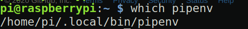
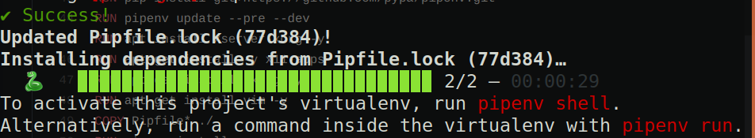

#なぜやるのか
久しぶりにラズパイの初期化を行ったので,環境構築するついでにメモを取ろうと思います.
本記事はラズパイでOpenCVによりカメラを使用するところまで行った時の備忘録です.

#SSH接続の有効化
まずは開発がしやすい様にssh接続を有効にします.

ターミナルを開いて
```
sudo apt update
sudo apt upgrade
sudo raspi-config
```
そして

5 Interfacing Optionsを選択します

P2 SSH を選択します

Would you like the SSH server to be enabled?と聞かれるのでYesを選択します

あとは完了が確認できたらfinishを選択して終わります

#SSH接続

次にSSH接続できるか確認します.
まずはラズパイのIPアドレスを確認します

```
ip a
```

(おそらくIPアドレスは192.168から始まっているものだと思います)

IPアドレスが確認できたら早速SSH接続をおこないます.

```
ssh -X pi@<先程確認したIPアドレス>
```
これでSSH接続ができているはずです

#Python環境の構築

それではOpenCVを用いてカメラを使用する準備をしていきます

まずはPython環境の構築をしていきます
```
sudo apt-get install python3.7 python-pip python3-pip python3-tk -y
```

ライブラリの管理を楽にするためにpipenvを導入します
```
pip3 install pipenv
```
パスが通っているか確認します.
```
which pipenv
```
何も表示されずパスが通っていない場合はテキストエディタで.bashrcにパスを追記します

.bashrcに以下を追記
```
PATH="${HOME}/.local/bin:${PATH}"
export PATH
```

.bashrcを読み込みます.
```
source ~/.bashrc
```

もう一度パスが通っているか確認し,画像の様になっていればOKです


#OpenCVのインストール
pipenvを使ってopencvをインストールします
まずはプログラムを置く用のディレクトリを作成しそこに移動します.
```
mkdir pycam
cd pycam
```

```
pipenv install opencv-contrib-python==3.4.4.19
pipenv install opencv-python==3.4.4.19
```
それぞれ時間がかかるので気長に待ちましょう.
自分の環境ではそれぞれ10分, 合計20分かかりました.

インストールができたら下の画像の様にSuccess!と出ているはずです.


次にOpenCVが使えるか確認をします
まずはpipenv仮想環境に入ります
```
pipenv shell
```
つぎにmain.pyというファイルに次のものを書き込んで. 実行します
```
import cv2 
print(cv2.__version__)
```

```
python3 main.py
```

ここでエラーが出るかもしれません
これはpipenvではpythonのライブラリは管理しますが,OpenCVはpythonライブラリ以外も必要とするのでエラーがでるみたいです.
エラーが出た場合おそらく下のコマンドをうち込めば大体直ると思います.
```
sudo apt-get install libatlas-base-dev
sudo apt-get install libjasper-dev
sudo apt-get install libqtgui4 libqtwebkit4 libqt4-test python3-pyqt5 
```

OpenCVのバージョンが確認できたでしょうか?
#Webカメラを使う
それではラズベリーパイでカメラを使っていきます.
先程作ったmain.pyの中身を書き換えます

```
import cv2

cap = cv2.VideoCapture(0)
while True:
    ret, frame = cap.read()
    if not ret:
        break
    cv2.imshow("Frame", frame)
    key = cv2.waitKey(1)
cap.release()
cv2.destroyAllWindows()


```


カメラの映像が確認できていれば成功です.

#まとめ

これでラズパイ上でOpenCVとカメラを使う環境が構築できたことと思います.


以上, raspberry piでカメラを使用するまででした.

