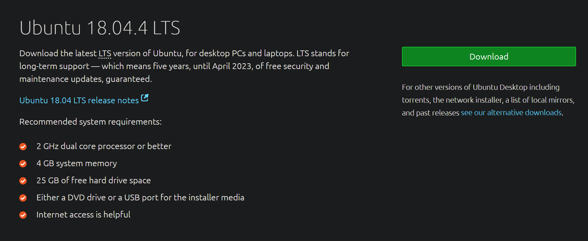
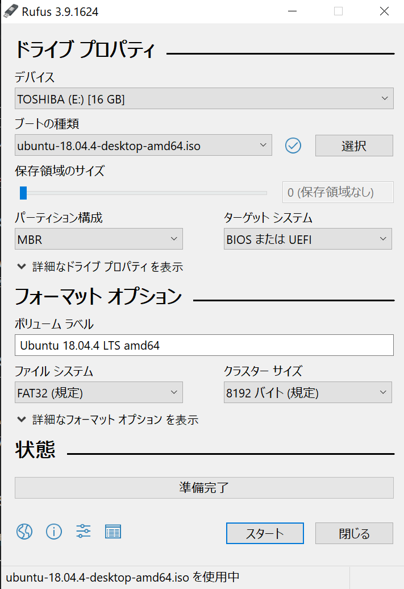
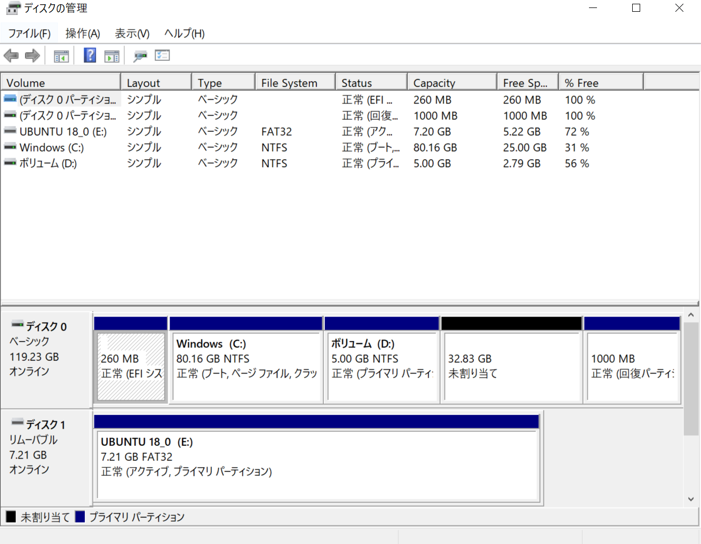
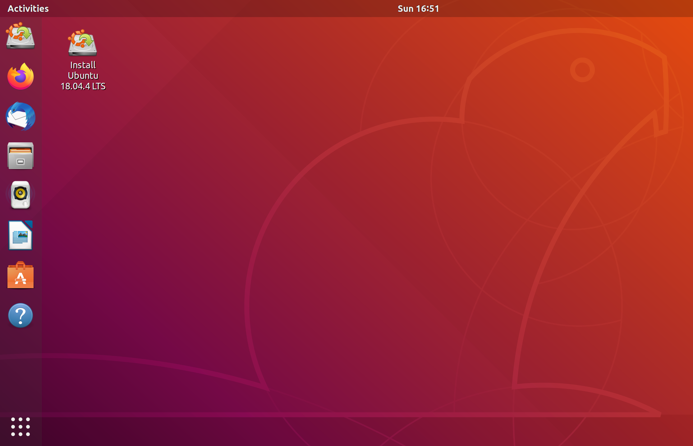
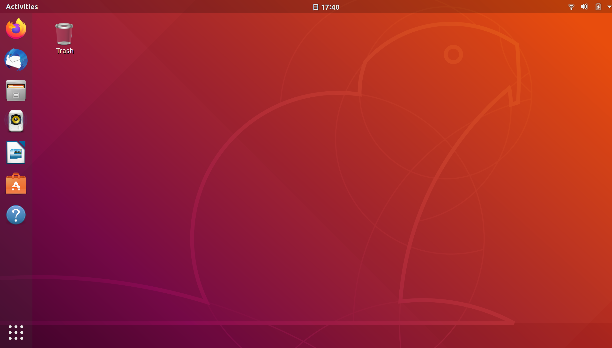

#なぜやるのか
久しぶりにUbuntuのクリーンインストールをすることになったので忘れないように備忘録として残すことにしました.

本記事はubuntu18.04とWindowsをデュアルブートを行うまでの備忘録です.

#LiveUSBの用意
まずはUbuntu用のLiveUSBを作成するために[Ubuntu](https://ubuntu.com/download/desktop)のOSイメージをダウンロードしましょう.

40分くらいかかります
次にダウンロードしたOSイメージをUSBに書き込みます.
ここでは[Rufus](https://rufus.ie/)を使います
LiveUSB用のUSBを差したらRufusを起動します.

デバイス:LiveUSB用のUSBの名前
ブートの種類横の選択:先ほどダウンロードしたOSイメージ
と選択して下さい
そしてスタートを押すと書き込みが始まります

#パーティションを分ける
左下のwindowsマークをクリック

ディスクの管理をクリック

Windows(C)を左クリックし, ボリュームの縮小をクリックしUbuntuをインストールする用の未割り当て領域を用意します
今回は30GB程度用意しました.

#bootの優先順位の変更
biosを起動してbootの優先順位を変更します

USB Hard Dickの優先順位を1番にします.

biosの立ち上げは電源を入れてメーカーのロゴが出ているときに特定のキーを連打すると立ち上がります
大体はメーカー名　bios key　とか検索すれば出てくると思います.
自分の場合はF2キーでした

#インストーラの立ち上げ
再び起動すると黒い画面に項目が3つほど出てきますがここでは
Try Ubuntu  without installing 
を選択します

Install Ubuntu 18.4.4LTSをクリックします

#Ubuntuのインストール

言語の設定はEnglish をおすすめします.
(日本語の設定は個別に入れたほうがいいです)

キーボードレイアウトは自分のPCに合うものを選んでください

ネットワークへ接続します

Updates and other softwareは

Normal installation

Download updates while installing Ubuntu

チェックをつけます.

installation typeは

someting else

にチェックをつけます.

Ubuntuをインストール用のpartionを初期化します
Windows側で作った未割り当て領域が「free space」と表示されているはずです.

Use as: Ext4

Mount point: /

を選択します.

つぎにインストールするpartisionに初期化したpartisionを選択します.

地域を選択します

ユーザーネームやパスワードを設定します.

インストールが終わるまでしばらく待ちます.

Continue Testingを選択します.

右上の逆三角系をクリックし,電源マークからPowe Offを選択します.

USBを抜いてから電源をつけてください.
またbiosを起動します.
ubuntuを優先順位1版にして再起動します

起動できれば成功です.

#まとめ

これで一応Ubuntuのクリーンインストールまで行えたことと思います.
次回はUbuntuのセットアップをしていこうと思います.

以上, ubuntu18.04とWindowsをデュアルブートするまででした.

