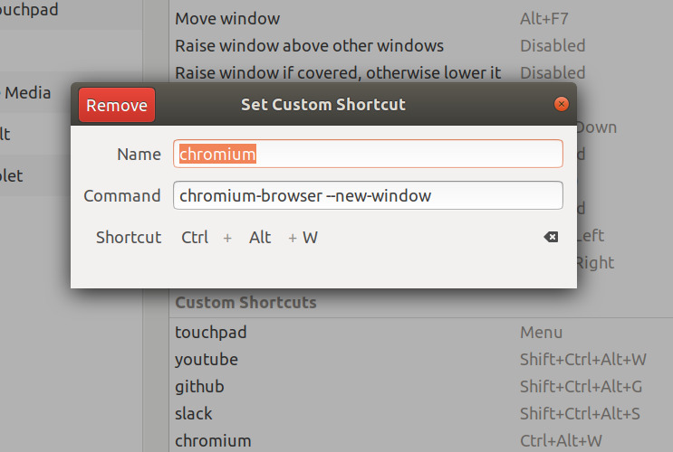

#なぜやるのか

前回Ubuntuをクリーンインストールしたのでまずは基本設定からして行きします.
本記事はUbuntu18.04の基本設定を行った時の備忘録です.

#aptのアップデート, アップグレード
まずは次のコマンドを実行してください.
```
sudo apt update
sudo apt upgrade
```


#時間ずれの解消

Ubuntu起動時のwindowsの時間ずれの解消を行います.

おそらくUbuntuの起動を確認したあと, Windowsを起動すると時間が9時間ほどずれていることと思います.

これを解消するには次のコマンドを実行してください.
```
sudo timedatectl set-local-rtc true
```
これで次回以降Ubuntuを起動するたびにWindows側の時間が9時間ずれるということはなくなるはずです.

次に日本語入力の設定です

次のコマンドを実行してください.
```
sudo apt install -y ibus-mozc
sudo reboot
```
再起動したら

SettingからRegion & Languageの項目に行き
Input Sources中の +ボタンをクリックしてください


次にJapanese -> Japanese(Mozc)を選択してくだい.
そしてデスクトップ画面右上のアイコンから次の図のようにチェックをつけます.


これで日本語入力できるはずです.

#まとめ

これでUbuntuの基本設定はおわりです.
次回は開発環境構築を行おうと思います.
今回はここまでです.お疲れ様でした.

(以下は個人的によく行う設定です.)


#capsをctrlにする

つぎのコマンドを実行すればcapsキーがctrlになります.
```
gsettings set org.gnome.desktop.input-sources xkb-options "['ctrl:nocaps']"
```

#Chromiumのインストール

```
sudo apt install chromium-browser
```
#時刻表示に日付を追加
デスクトップ画面上部の時間表示に日付を追加するには次のコマンドを実行してくだい

```
gsettings set org.gnome.desktop.interface clock-show-date true
```

#ショートカットキーの設定

Settings -> Devices -> Keyboard  とクリックしていき, 1番下の+ボタンを押すことでショートカットキーを設定することができます.


