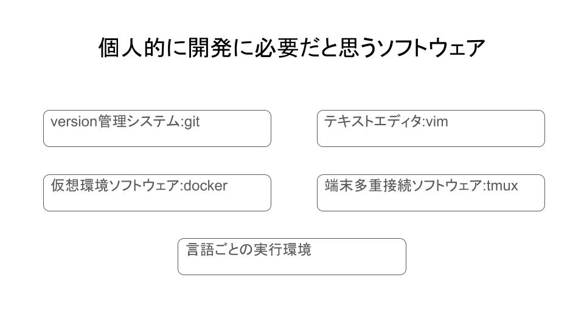

#なぜやるのか

前回Ubuntuをクリーンインストールし基本設定を行ったので,今回は僕がよく行う開発環境構築を行っていきたいと思います.
本記事はUbuntu18.04で開発環境構築を行ったときの備忘録です.

#個人的に開発に必要だと思うソフトウェア



#aptのアップデート, アップグレード
まずは次のコマンドを実行してください.
```
sudo apt update
sudo apt upgrade
```

#curlのインストール

先にcurlをインストールしておいてください.
```
sudo apt install curl
```

#gitのインストール
バージョン管理にはgitを使います.

```
sudo apt install git
```


#テキストエディタのインストール

自分はvim,neovimをよく使うので今回はこの2つをインストールします.

vimのインストール

```
sudo apt install vim
```

neovimのインストール

neovimも入れたい方は次のコマンドを実行してください.

次のコマンドで多分最新のneovimをインストールできるようになっているはずです.


```
sudo apt install -y nodejs npm
sudo npm install n -g
sudo n stable
sudo apt purge -y nodejs npm
sudo apt-get install software-properties-common
sudo add-apt-repository ppa:neovim-ppa/unstable
sudo apt-get update
sudo apt-get install neovim
```

#端末多重接続ソフトウェア(terminal multiplexer)のインストール

これは1画面で複数のターミナルと接続できるようなソフトウェアです.

tmuxをインストールします.

sshセッションの記憶もできるのでおすすめです.ついでにtmux上でコピペを行うようにxsel,xclipもついでにインストールしておきます

tmuxのインストール
```
sudo apt install tmux
sudo apt install xsel
sudo apt install xclip
```

#dockerのインストール

dockerは軽量な仮想環境を構築するソフトウェアです.
新しく言語を勉強するときや共同で開発するときにとても便利です.

```
sudo apt-get remove docker docker-engine docker.io containerd runc
```
```
sudo apt-get update
```
```
sudo apt-get install \
    apt-transport-https \
    ca-certificates \
    curl \
    gnupg-agent \
    software-properties-common
```
```
curl -fsSL https://download.docker.com/linux/ubuntu/gpg | sudo apt-key add -
```
```
sudo apt-key fingerprint 0EBFCD88
```
```
sudo add-apt-repository \
   "deb [arch=amd64] https://download.docker.com/linux/ubuntu \
   $(lsb_release -cs) \
   stable"
```
```
sudo apt-get update
```
```
sudo apt-get install docker-ce docker-ce-cli containerd.io
```
```
sudo docker run hello-world
```
```
sudo usermod -aG docker $USER
```
```
sudo reboot
```

#docker-composeのインストール

docker-composeはdockerコンテナを管理しやすくするソフトウェアです.

```
sudo curl -L "https://github.com/docker/compose/releases/download/1.25.4/docker-compose-$(uname -s)-$(uname -m)" -o /usr/local/bin/docker-compose
```
```
sudo chmod +x /usr/local/bin/docker-compose
```
```
sudo ln -s /usr/local/bin/docker-compose /usr/bin/docker-compose
```
```
docker-compose --version
```


#まとめ

これで僕がよく行うUbuntuでの開発環境構築はおわりです.
お疲れ様でした.

#おまけ

C/C++,make(その他)のインストール

build-essentialをインストールするとC/C++コンパイラやmakeコマンドなど開発に便利なビルドツールパッケージがまとめてインストールできます.

```
sudo apt install build-essential
```

次のコマンドでインストールができているか確認してください

```
g++ --version
```

Python環境,pipenvのインストール

```
sudo apt install python3.7 python-pip python3-pip python3-tk -y
```

次のコマンドでインストールができているか確認してください

```
python3.7 --version
```

```
pip3 install pipenv
```

次のコマンドでインストールができているか確認してください

```
pipenv --version
```

またlocal/binにインストールされたコマンドを使うために.bashrcに以下を追記してください

```
PATH="${HOME}/.local/bin:${PATH}"
export PATH
```
