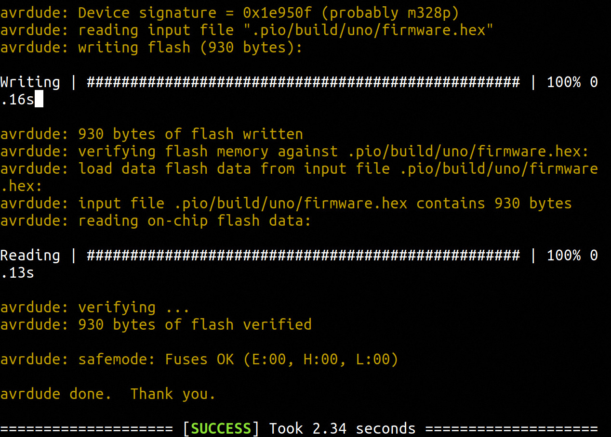
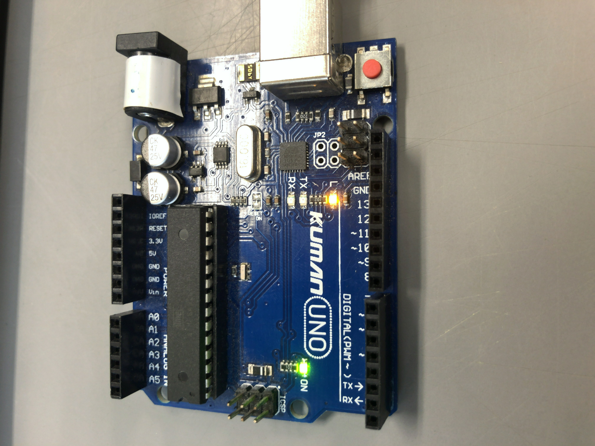
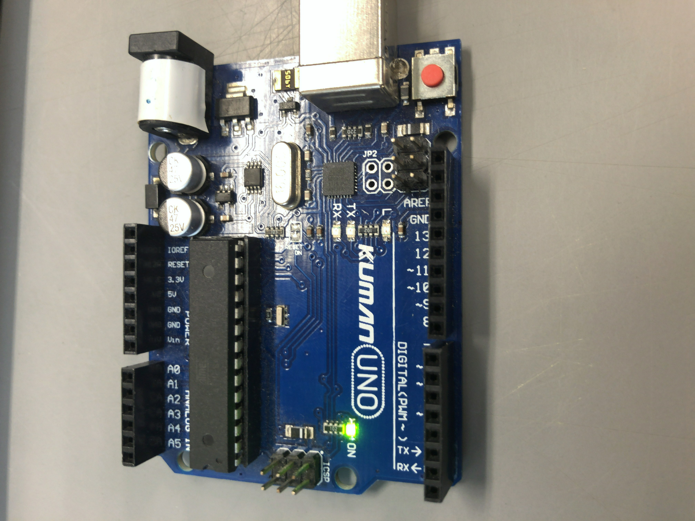

#なぜやるのか

arduinoの開発を統合開発環境内で行うとどうしてもエディタが使いづらかったりライブラリの管理が面倒くさいと思いCLIで扱える開発環境がほしいと思ったため.

本記事はplatformioを用いてCLIからarduinoを開発する環境を構築するまで行った時の備忘録です.

#platformのインストール

今回はpipenvを使ってplatformをインストールしようと思います.
基本的に[ここ](https://docs.platformio.org/en/latest/core/installation.html)と[ここ](https://docs.platformio.org/en/latest/core/quickstart.html)を参考にすれば行けると思います.

pipenvをインストールしていない場合は次を実行してください.

```
sudo apt install python3.7 python-pip python3-pip python3-tk -y
pip3 install pipenv
```

また.bachrcには次のようにPathが通っている状態にしておいてください.

.bashrcに以下を追記
```
PATH="${HOME}/.local/bin:${PATH}"
export PATH
```
再ログインし
which pipenv
```
which pipenv
```
でPathが表示されるか確認
arduinoのprojectを置くようのディレクトリを作成します.

```
mkdir embedded
cd embedded
```
pipenvを使ってplatformioをインストールします.

```
pipenv install --python 3.7
pipenv install platformio
```

グループにユーザを追加

```
sudo usermod -a -G dialout ${USER}
```
また公式にもあるように99-platformio-udev.rulesというのを置かないといけないです.

```
cd /etc/udev/rules.d
wget https://github.com/platformio/platformio-core/blob/develop/scripts/99-platformio-udev.rules
```

念のためrebootします.

```
sudo reboot
```

現時点でのディレクトリ構成は以下の通りになっていると思います.

```
embedded
├── Pipfile
└── Pipfile.lock
```
#プロジェクトのセットアップ

それではプロジェクトのセットアップをしていきます.
今回はarduino unoを使います
embedde/の下で
```
pipenv shell
mkdir path_to_the_new_directory
cd path_to_the_new_directory/
platformio project init --board uno
```
これでディレクトリ構成は以下の通りになっていると思います.
```
.
├── include
│   └── README
├── lib
│   └── README
├── platformio.ini
├── src
└── test
    └── README
```

#sample programの作成

それではsrc/下でmain.cppを作成してここにsample programを書き込みます.

main.cpp

```
#include "Arduino.h"

#ifndef LED_BUILTIN
#define LED_BUILTIN 13
#endif

void setup()
{
  // initialize LED digital pin as an output.
  pinMode(LED_BUILTIN, OUTPUT);
}

void loop()
{
  // turn the LED on (HIGH is the voltage level)
  digitalWrite(LED_BUILTIN, HIGH);

  // wait for a second
  delay(1000);

  // turn the LED off by making the voltage LOW
  digitalWrite(LED_BUILTIN, LOW);

   // wait for a second
  delay(1000);
}
```
最終的なディレクトリ構成は以下の通りになっているはずです.

```
.
├── include
│   └── README
├── lib
│   └── README
├── platformio.ini
├── src
│   └── main.cpp
└── test
    └── README

```
それではpath_to_the_new_directory/下で次のコマンドを実行し,arduinoにprogramを書き込みます.

```
platformio run
platformio run --target upload
```
下の画像のように表示されていれば書き込めているはずです.


arduinoのLEDが点灯していたらOKです.






#まとめ

これで一応arduinoをCLIで開発する環境が整ったと言えると思います.


以上, platformioを用いてCLIからarduinoを開発する環境を構築するまででした.

