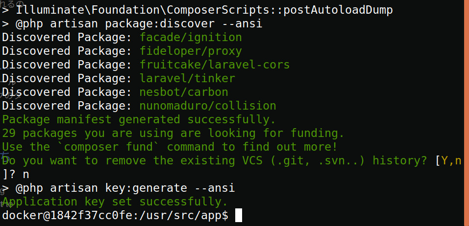
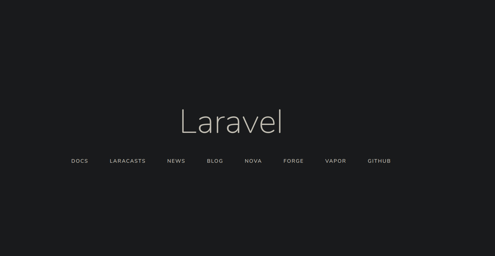

#なぜやるのか
laravelの環境構築のメモを残そうと思ったため.

本記事はlaravel環境をdocker上で構成した時の備忘録です.

完成後のディレクトリ構成は以下の通りになります.

```
.
├── docker/php/Dockerfile
├── docker-compose.yml
└── your-project-name
```
#Dockerの前準備

まずはdocker-compose.ymlから.

docker/php/Dockerfilesを読み込みます.

portは8000番を使います

```yml:docker-compose.yml
version: "3"
services:
  db:
    image: mysql:8.0
    container_name: laravel_mysql
    ports:
      - "3306:3306"
    environment:
      MYSQL_ROOT_PASSWORD: root
      MYSQL_PASSWORD: password
      TZ: 'Asia/Tokyo'
    command: mysqld --default-authentication-plugin=mysql_native_password --character-set-server=utf8mb4 --collation-server=utf8mb4_ja_0900_as_cs

  php:
    build:
      context: ./docker/php/
    container_name: laravel_web
    volumes:
      - ./:/usr/src/app
    ports:
      - "8000:8000"
    working_dir: /usr/src/app
    stdin_open: true
    tty: true
    links:
      - db
```

次にDockerfileです.

今回はimgesはphp:7.2を使いました.

./Dockerfiles/gatsby/Dockerfile
```Dockerfile:Dockerfile
FROM php:7.2

RUN apt-get update && apt-get upgrade -y
RUN apt-get install -y git 
RUN apt-get install -y wget
RUN apt-get install -y curl 
RUN apt-get install sudo -y

RUN curl https://getcomposer.org/installer | php
RUN mv composer.phar /usr/local/bin/composer

ARG DOCKER_UID=1000
ARG DOCKER_USER=docker
ARG DOCKER_PASSWORD=docker
RUN useradd -m --uid ${DOCKER_UID} --groups sudo ${DOCKER_USER} \
  && echo ${DOCKER_USER}:${DOCKER_PASSWORD} | chpasswd
USER ${DOCKER_USER}

```

イメージのbuildとコンテナの立ち上げを行います.

```
$ docker-compose up --build
```

別のターミナルを開き以下のコマンドで仮想環境に入ります.


laravel_webは各環境で変わるかもなので適時読み替えてください.(大体はTabキーの補完でどうにかなるとは思いますが)

```
$ docker exec -it laravel_web /bin/bash
```

#laravel
それではlaravelで動作確認をしていきましょう.

まずはアプリケーションの雛形を作ります
以下のコマンドを実行してください
```
$ composer create-project laravel/laravel your-project-name --prefer-dist

```
しばらく待ち,

Do you want to remove the existing VCS (.git, .svn..) history? [Y,n]? n
と聞かれるのでyかnを入力します.



このように表示されていれば成功のはずです.

your-project-nameというディレクトリができたと思います

そこに移動してphp artisan serveを行い

```
$ cd your-project-name

$ php artisan serve --host 0.0.0.0

```

[http://0.0.0.0:8000](http://0.0.0.0:8000/)

をブラウザで開くとLaravelと表示されているのが確認できるはずです.




#まとめ
これで一応laravelの環境がdocker上でできあがっていることになると思います.

以上, docker上でlaravel環境を構築するまででした.

