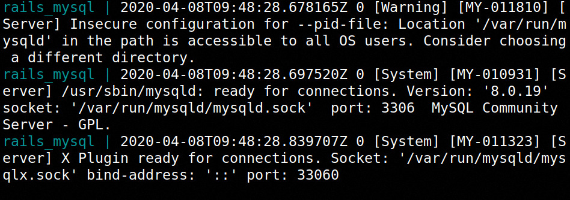
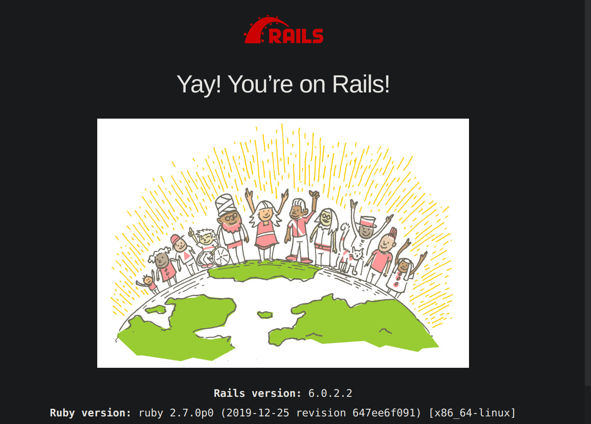

#なぜやるのか
railsの環境構築のメモを残そうと思ったため.

本記事はrails環境をdocker上で構成しYay! You’re on Rails!!まで行った時の備忘録です.

完成後のディレクトリ構成は以下の通りになります.

```
.
├── docker-compose.yml
├── Dockerfiles/rails/Dockerfile
└── hello-app
```
#Dockerの前準備

まずはdocker-compose.ymlから.

Dockerfiles/rails/Dockerfilesを読み込みます.

portは3000番を使います

```yml:docker-compose.yml
version: '3'
services:
  db:
    image: mysql:8.0
    container_name: rails_mysql
    ports:
      - "3306:3306"
    environment:
      MYSQL_ROOT_PASSWORD: root
      MYSQL_PASSWORD: password
      TZ: 'Asia/Tokyo'
    command: mysqld --default-authentication-plugin=mysql_native_password --character-set-server=utf8mb4 --collation-server=utf8mb4_ja_0900_as_cs

  web:
    build: ./Dockerfiles/rails/
    container_name: rails_web
    volumes:
      - .:/usr/src
    ports:
      - "3000:3000"
    environment:
      PORT: 3000
      BINDING: 0.0.0.0
    stdin_open: true
    tty: true
    links:
      - db
```

次にDockerfileです.

今回はimgesはruby:2.7.0を使いました.

./Dockerfiles/gatsby/Dockerfile
```Dockerfile:Dockerfile
FROM ruby:2.7.0

ENV LANG C.UTF-8
ENV APP_ROOT /usr/src

WORKDIR $APP_ROOT

RUN set -ex && \
    apt-get update -qq && \
    apt-get install -y sudo && \
    : "Install node.js" && \
    curl -sL https://deb.nodesource.com/setup_10.x | sudo -E bash - && \
    apt-get update -qq && \
    apt-get install -y nodejs && \
    : "Install yarn" && \
    curl -sS https://dl.yarnpkg.com/debian/pubkey.gpg | sudo apt-key add - && \
    echo "deb https://dl.yarnpkg.com/debian/ stable main" | sudo tee /etc/apt/sources.list.d/yarn.list && \
    apt-get update -qq && \
    apt-get install -y yarn && \
    : "Install rails6.X latest version" && \
    gem install rails --version="~>6.0.0"
RUN apt-get install vim -y

ARG DOCKER_UID=1000
ARG DOCKER_USER=docker
ARG DOCKER_PASSWORD=docker
RUN useradd -m --uid ${DOCKER_UID} --groups sudo ${DOCKER_USER} \
  && echo ${DOCKER_USER}:${DOCKER_PASSWORD} | chpasswd
USER ${DOCKER_USER}
```

イメージのbuildとコンテナの立ち上げを行います.

```
$ docker-compose up --build
```

別のターミナルを開き以下のコマンドで仮想環境に入ります.


rails_webは各環境で変わるかもなので適時読み替えてください.(大体はTabキーの補完でどうにかなるとは思いますが)

```
$ docker exec -it rails_web /bin/bash
```

#rails
それではrailsの動作確認をしていきましょう.

まずはアプリケーションの雛形を作ります
以下のコマンドを実行してください
```
$ raiils new hello-app
```
しばらく待ち,




このように表示されていれば成功のはずです.

hello-appというディレクトリができたと思います

そこに移動してrails s を行い

```
$ cd hello-app
$ rails s
```

[http://0.0.0.0:3000](http://localhost:8000/)

をブラウザで開くとYay! You’re on Rails!と表示されているのが確認できるはずです.




#まとめ
これで一応railsの環境がdocker上でできあがっていることになると思います.

以上, docker上でrails環境を構築しYay! You’re on Rails!するまででした.

